[English](README.md) · **Deutsch**

# convertible-keyboard-pcb

> ### 🔎 Gehäuse-Designer gesucht
> Die Platine dieser Tastatur entsteht gerade, ein Gehäuse gibt es noch nicht.
> Wenn du Tastaturgehäuse entwirfst — 3D-gedruckt, CNC-gefräst oder
> lasergeschnitten — und Lust auf dieses Projekt hast, eröffne gern ein
> [Issue](https://github.com/TechnikWeber/convertible-keyboard-pcb/issues).
> Ein erster Platinenumriss steht (Tastenfeld + 1,3 mm), aber Umriss,
> Befestigungslöcher und die Lage der USB-C-Buchse können sich noch nach deinem
> Gehäuse richten — für die
> Full-Size-Variante, die TKL oder beide. Dasselbe gilt für die genaue Position
> der Lock-Anzeigen. Die USB-Buchse kann auf der Platine sitzen oder auf einem
> Unified Daughterboard (Pico-EZmate oder JST-SH).

**Eine Tastaturplatine, zwei Größen.** Eine Full-Size-Platine für ISO-DE und
ANSI, deren Ziffernblock sich an einer Sollbruchstelle abbrechen lässt. Übrig
bleibt eine vollständige Tenkeyless-Tastatur (TKL) — gleiche Platine, gleicher
Controller, gleiche Firmware.

Das soll kein weiteres Einmal-DIY-Keyboard werden. Ziel ist ein standardisiertes
Kernprojekt, auf dem andere aufbauen können: günstig und einfach zu fertigen,
aber sauber und modern — mit aktuellem KiCad, QMK, USB-C und Bauteilen, die man
wirklich kaufen kann. Gehäuse, Beleuchtung oder Layout-Varianten setzen auf
diesem Kern auf, statt ihn zu verbiegen.

> **Status: am Anfang.** Der Schaltplan ist vollständig — Tastenmatrix,
> ANSI-Alternativen, Beleuchtung und Controller — und jedes Bauteil hat seinen
> Footprint auf der Platine; Controller, USB und Treiber sind auf der Rückseite
> platziert, Platinenumriss und Sollbruchstelle sind gezeichnet.
> Befestigungslöcher und Routing fehlen noch. Gefertigt wurde bisher nichts.

## Full-Size oder TKL

- Der Ziffernblock sitzt rechts hinter einem 2 mm breiten Schlitz und hängt an
  vier Mouse-Bite-Stegen (perforierte Bruchstege). Jeder Steg hat in der Mitte
  einen lochfreien Kanal für die Leitungen, die hinüberlaufen.
- Controller, USB-C sowie die Treiber für Beleuchtung und Lock-Anzeigen liegen
  alle auf dem TKL-Teil. Nur die Matrix-, Beleuchtungs- und
  Anzeigeleitungen des Ziffernblocks laufen über die Bruchkante.
- Ziffernblock abbrechen, und die TKL funktioniert unverändert weiter — die
  Ziffernblocktasten gibt es dann einfach nicht mehr. Die Firmware beschreibt
  beide Layouts.
- Die Lock-Anzeigen über dem Ziffernblock gehen mit – ohne Ziffernblock ist
  Num Lock ohnehin sinnlos; für die TKL bestückt man die Caps-Lock-Anzeige über
  Bild auf.
- Der abgebrochene Ziffernblock hat keinen eigenen Controller und funktioniert
  allein nicht.

## Eckdaten

- Full-Size: 105 Tasten ISO-DE, Tastenfeld 428,6 × 123,8 mm (22,5 × 6,5 u)
- TKL: 88 Tasten ISO-DE, Tastenfeld 347,7 × 123,8 mm (18,25 × 6,5 u)
- ISO-DE und ANSI auf einer Platine: Alternativpositionen für Enter, linkes
  Shift und Backslash (der ANSI-Backslash ist die einzige Taste ohne LED)
- Cherry-MX-kompatible Schalter, gelötet, mit Stabilisator-Bohrungen für alle
  Tasten ab 2u
- 6 × 21 Diodenmatrix (SOD-123)
- RP2040 als Controller mit 16-Mbit-QSPI-Flash, RESET- und BOOTSEL-Taster und
  SWD-Testpads
- USB-C (USB 2.0) auf der Platine mit ESD-Schutz, 500-mA-Polyfuse und 3,3-V-LDO –
  oder stattdessen ein Unified Daughterboard: Anschlüsse für Molex Pico-EZmate
  (uDB S1, C4, C5-EZM) und JST-SH (uDB C3, C5-JSH) sind vorgesehen, nicht bestückt
- Einfarbige Hintergrundbeleuchtung mit Reverse-Mount-1206-LEDs auf der Rückseite
  (weiß, XINGLIGHT XL-3216UWC-FB), maschinell bestückt; über QMK schaltbar,
  dimmbar und mit „Breathing“. Eine THT-LED-Variante nutzt denselben Entwurf mit
  anderen LED-Footprints
- Geprüfte Alternativ-LEDs für denselben Footprint: MEIHUA MHT151WDT
  (LCSC C401114) und TUOZHAN P2-1206WYCS2-0.9T-F (LCSC C2827252)
- Anzeige für Caps Lock und Num Lock (0805) über dem Ziffernblock; für die TKL ist
  eine Caps-Lock-Anzeige über Bild auf vorgesehen, aber nicht bestückt
- Alle 30 GPIOs des RP2040 belegt: 27 Matrixleitungen, Beleuchtungs-PWM,
  Caps Lock und Num Lock

## Repository

| Pfad | Inhalt |
|---|---|
| `convertible-keyboard-pcb.kicad_pro` / `.kicad_pcb` | KiCad-10-Projekt und Platine |
| `convertible-keyboard-pcb.kicad_sch` | Hauptblatt: Tastenmatrix und ANSI-Alternativen |
| `backlight.kicad_sch` | Tasten-LEDs, Vorwiderstände und MOSFET-Treiber |
| `mcu.kicad_sch` | RP2040, Flash, Quarz, USB-C und Stromversorgung |
| `lib/keyboard.pretty` | Projekt-Footprints: Reverse-Mount-LED, THT-LED für die Variante |
| `fp-lib-table`, `convertible-keyboard-pcb.kicad_dru` | Footprint-Bibliothekstabelle, Designregel für die LED-Aussparungen |
| `lib/MX_Alps_Hybrid` | Schalter-Footprints von ai03 (Git-Submodul) |
| `tools/` | Skripte, die die Blätter erzeugt und die Platine aktualisiert haben – siehe [tools/README.de.md](tools/README.de.md) |
| `docs/production/` | Gerber, Bohrdatei, Stückliste und Bestückungsdaten für JLCPCB |
| `firmware/` | QMK-Definition und Keymaps – siehe [firmware/README.de.md](firmware/README.de.md) |

Die Footprints liegen in einem Submodul, deshalb so klonen:

```bash
git clone --recurse-submodules https://github.com/TechnikWeber/convertible-keyboard-pcb.git
```

## Wie es aussieht

Mit diesen Bildern lässt sich das Design ohne KiCad durchsehen.

### Tastenlayouts

Darauf baut alles auf: ISO-DE mit 105 Tasten und ANSI mit 104. Die Platine trägt beide. Die ANSI-Positionen sind
Alternativ-Footprints, die bei einem ISO-Aufbau unbestückt bleiben – und umgekehrt.

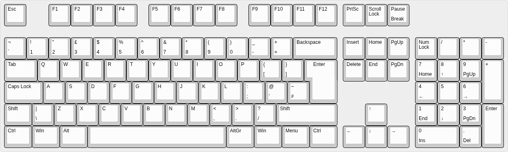

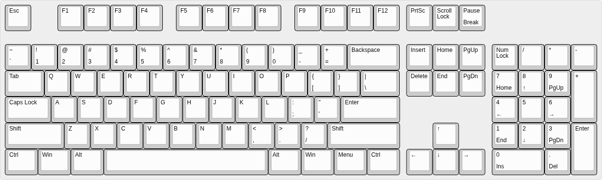

### Platine in 3D

Schalterseite: Durchkontaktierungen für Schalter und Stabilisatoren, keine Bauteile. Gut zu sehen ist die
Sollbruchstelle vor dem Ziffernblock.

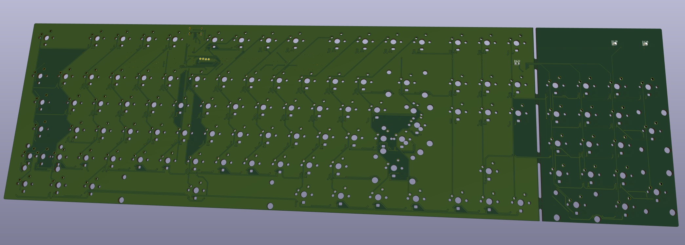

Bestückungsseite: Hier sitzt fast alles. Je Taste Diode und Vorwiderstand, die Reverse-Mount-LEDs leuchten
durch ihre Aussparungen, und der Controller sitzt in der Lücke zwischen F4 und F5. Auf der anderen Seite
liegen nur die beiden Lock-Anzeigen über dem Ziffernblock.

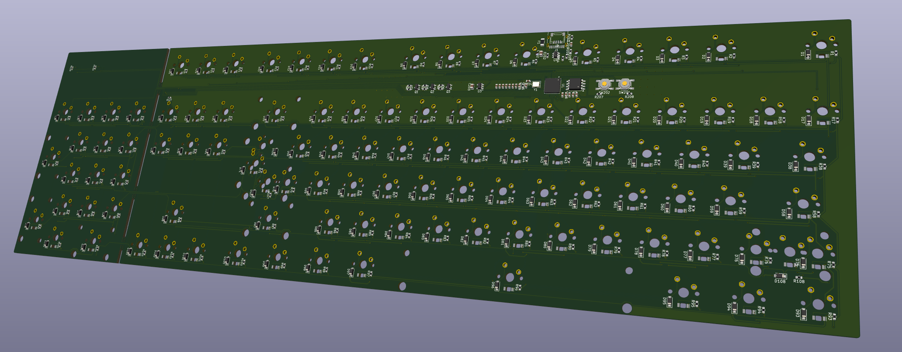

### Platine

Beide Kupferlagen, Kupferflächen ausgeblendet, damit die Leiterbahnen lesbar bleiben. Der Ziffernblock rechts
bricht an der Sollbruchstelle ab; darüber laufen nur Matrixleitungen, +5V, BL_K und die zwei Lock-LED-Leitungen,
und zwar durch die vier Stege.

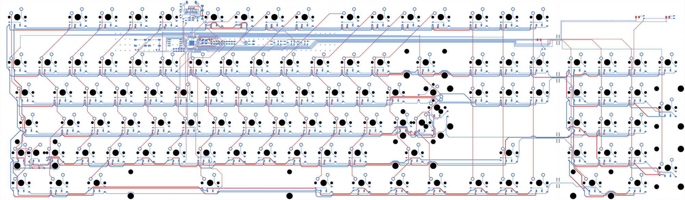

Der Controller sitzt in der Lücke zwischen F4 und F5. Spalten- und Zeilenleitungen laufen in festen Kanälen und
enden jeweils auf einem Via, das auf die Spaltenleitung der Taste führt. Jedes SMD-Bauteil in diesem Bereich
liegt auf der Rückseite.

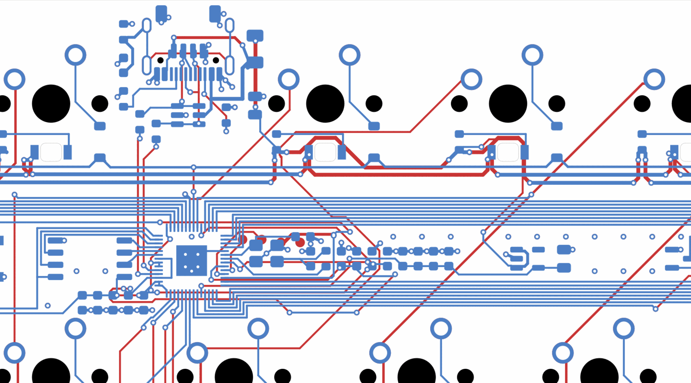

Vorderseite (Schalterseite, im Wesentlichen Durchkontaktierungen und die Tastenmatrix) und Rückseite (alle
Bauteile, Reverse-Mount-LEDs):

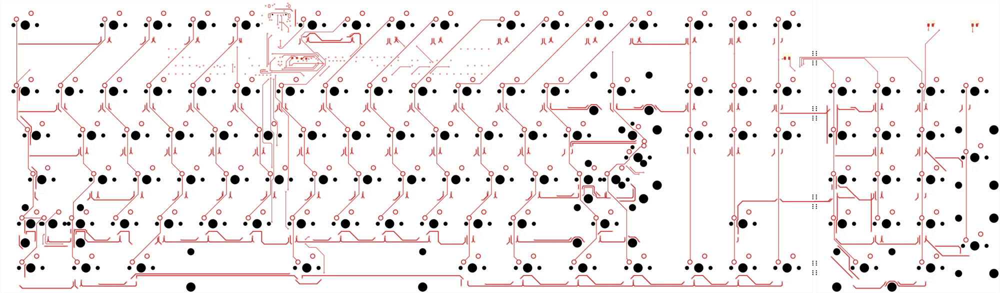

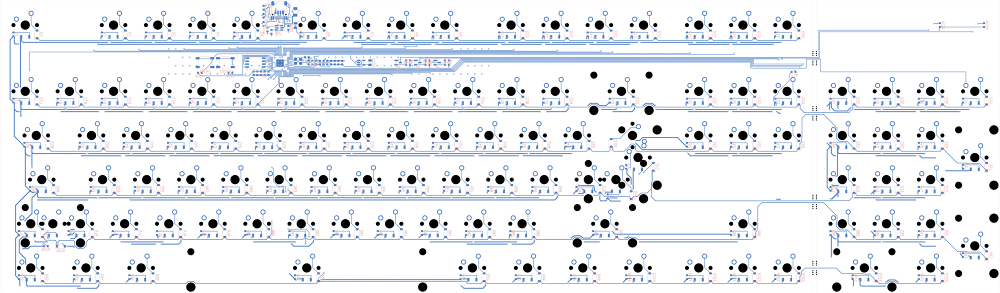

### Schaltplan

Tastenmatrix mit den ANSI-Alternativen:

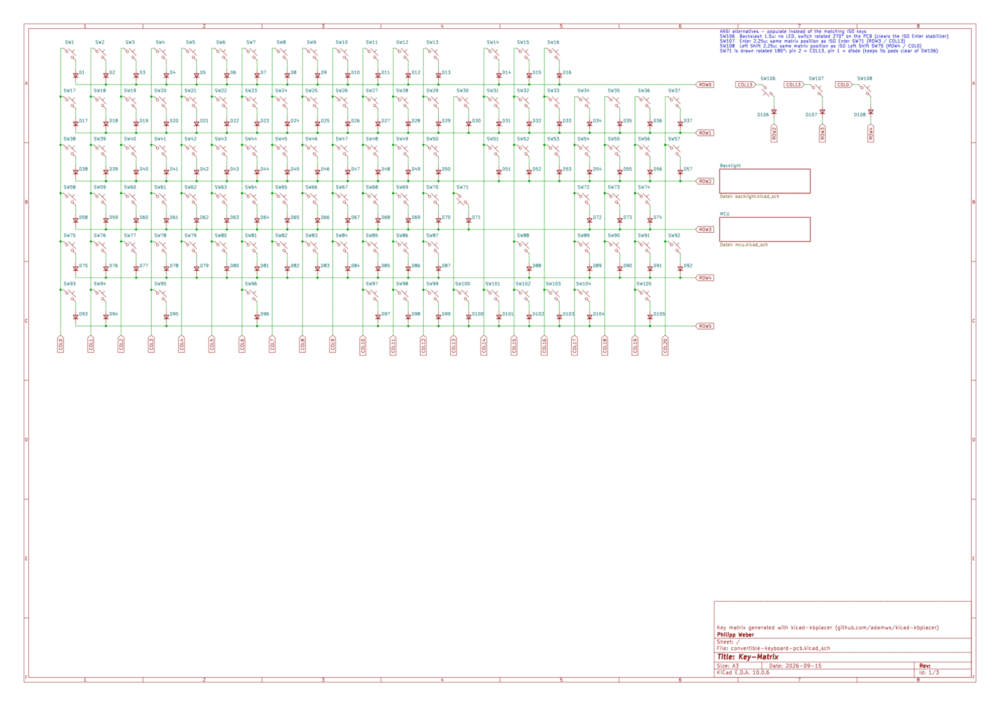

Beleuchtung, Lock-Anzeigen und ihre Treiber:

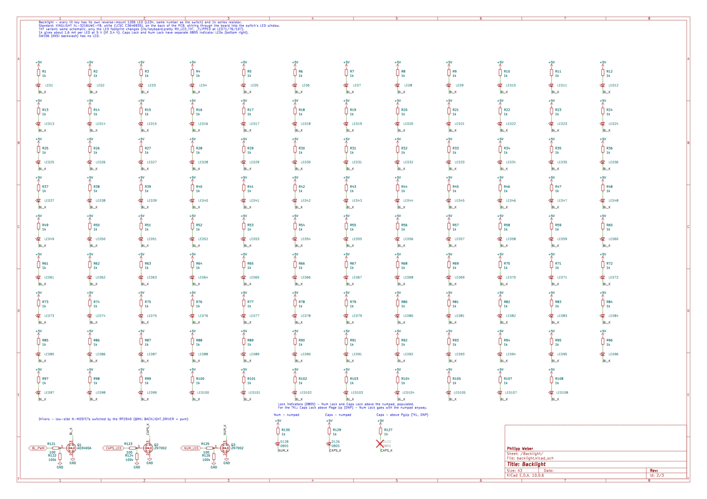

Controller: RP2040, Flash, Quarz, LDO, USB-C mit ESD-Schutz, Daughterboard-Anschlüsse, Taster, Testpads:

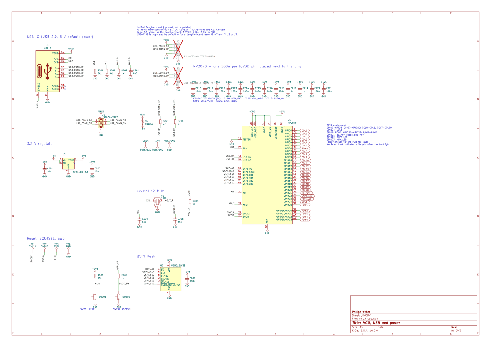

## Fertigen lassen

Gerber, Bohrdatei, Stückliste und Bestückungsdaten für JLCPCB liegen in
[`docs/production/`](docs/production/README.de.md) und werden aus dem KiCad-Projekt erzeugt. Die Platine
misst 431,225 × 126,425 mm auf zwei Lagen. 371 Bauteile werden maschinell bestückt, die 108 MX-Schalter
von Hand gelötet, drei Teile bleiben bewusst unbestückt.

Gebaut wurde davon noch nichts. Die Dateien bestehen DRC und Schaltplan-Parität, mehr nicht — vor dem
Bestellen selbst prüfen.

## Fahrplan

- [x] Tastenmatrix und Dioden
- [x] Footprints für alle Tastengrößen
- [x] ANSI-Alternativpositionen
- [x] Einfarbige Hintergrundbeleuchtung
- [x] Controller-Blatt: RP2040, Flash, Quarz, LDO, USB-C, ESD-Schutz
- [x] Sollbruchstelle für den Ziffernblock
- [x] Platinenumriss (erster Entwurf)
- [x] Befestigungslöcher: 14 × M2, in die freien Flächen gesetzt; endgültige Lage gemeinsam mit dem
      Gehäuse-Designer
- [x] Platzierung von Controller, USB und Treibern (vorläufig)
- [x] Routing vollständig: Tastenfeld und Controller-Bereich (DRC ohne Meldung, Parität sauber,
      keine offenen Verbindungen)
- [x] Fertigungsdaten für JLCPCB: Gerber, Bohrdatei, Stückliste und Bestückungsdaten, LCSC-Nummer an
      jedem Teil
- [x] Firmware (QMK): vier Layouts (Full-Size und TKL, je ISO und ANSI), Matrix aus der Platinendatei
      erzeugt, Beleuchtung und Lock-Anzeigen; kompiliert, noch nicht auf Hardware gelaufen

## Lizenz

CC BY-NC-SA 4.0 — siehe [LICENSE](LICENSE). Die Schalter-Footprints in
`lib/MX_Alps_Hybrid` stammen von ai03 und stehen unter der MIT-Lizenz;
die THT-LED-Footprints in `lib/keyboard.pretty` übernehmen deren Pad-Geometrie.
